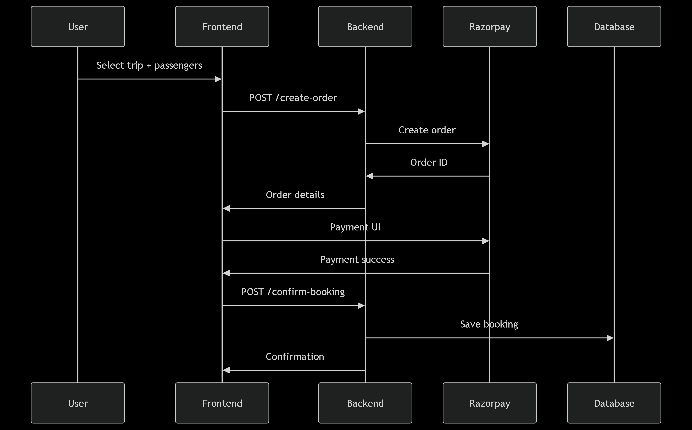

# 🧳 Trip Booking App - Full Documentation

## 🔑 Default Admin Credentials

| Username | Password   |
|----------|------------|
| admin    | admin123   |


---

## 📌 Project Overview
Trip Booking App is a full-stack web application that allows users to browse trips, book trips for multiple passengers, and make payments securely using Razorpay. Admins can manage trips and view all bookings.

## ⚙️ Tech Stack

- **Frontend:** Angular / React  
- **Backend:** Node.js, Express.js  
- **Database:** MongoDB + Mongoose  
- **Authentication:** JWT  
- **Payment Gateway:** Razorpay  
- **Deployment:** Docker / Render / Vercel (optional)

---

## 🔐 Authentication & Roles

- **JWT-based login**
- **Roles:** `admin`, `user`
- **Middlewares:** `auth`, `isAdmin`, `isUser`

---

## ✨ Core Features

### 👤 User:
- Register/Login  
- Browse trips  
- Book trip with multiple passengers  
- Razorpay payment  
- View booking history  

### 🛠️ Admin:
- Manage trips (CRUD)  
- View all bookings  

---

## 💳 Booking Flow with Razorpay

1. User selects trip and fills passenger form  
2. Frontend calls `POST /create-order`  
3. User completes payment via Razorpay  
4. Frontend calls `POST /confirm-booking`  
5. Server verifies payment, saves booking, updates trip enrolled count  

---

## 📡 API Endpoints

### 🔐 Auth
- `POST /api/auth/register`  
- `POST /api/auth/login`  

### 🧳 Trips
- `GET /api/trips`  
- `GET /api/trips/:id`  
- `POST /api/trips` (admin)  
- `PUT /api/trips/:id` (admin)  
- `DELETE /api/trips/:id` (admin)  

### 📅 Bookings
- `POST /api/bookings/create-order` – Create Razorpay order  
- `POST /api/bookings/confirm-booking` – Confirm booking after payment  
- `GET /api/bookings/my` – Get user’s bookings  
- `GET /api/bookings/all` – Admin: get all bookings  
- `GET /api/bookings/:id` – Get a specific booking  

---

## Diagram
  

## 🚀 Setup Instructions

```bash
git clone <repo-url>
cd trip-booking-app
cd frontend
npm install
npm run dev
cd backend
npm install
npm run dev
